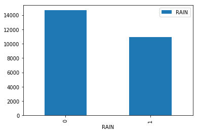
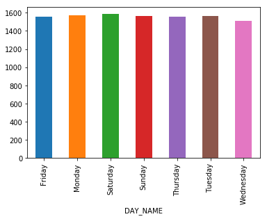
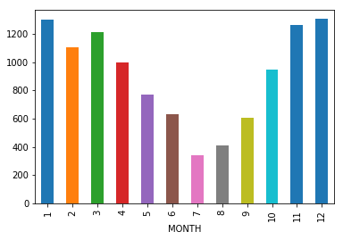
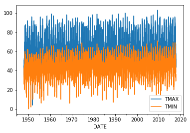
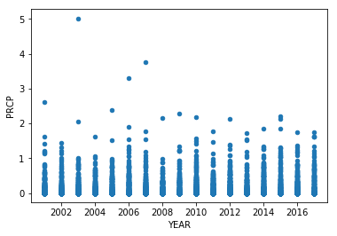
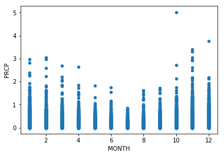
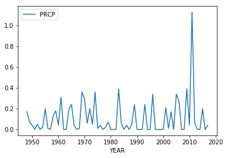

# Seattle Weather Data 1948-2017


```python
# Render plots inline as output (SHOW STUDENTS WHAT THIS LOOKS LIKE WITHOUT IT)
%matplotlib inline

# Global imports for the notebook
# NOTE: Rerun the complete notebook when imports are changed
import pandas as pd
import numpy as np
import matplotlib as plt
from datetime import date
```


```python
# Read in the weather csv file
df = pd.read_csv('./seattleWeather_1948-2017.csv')
# Print the first five lines - ensure students know this is a 'peek'
df.head()
```


<div>
<style scoped>
    .dataframe tbody tr th:only-of-type {
        vertical-align: middle;
    }

    .dataframe tbody tr th {
        vertical-align: top;
    }

    .dataframe thead th {
        text-align: right;
    }
</style>
<table border="1" class="dataframe">
  <thead>
    <tr style="text-align: right;">
      <th></th>
      <th>DATE</th>
      <th>PRCP</th>
      <th>TMAX</th>
      <th>TMIN</th>
      <th>RAIN</th>
    </tr>
  </thead>
  <tbody>
    <tr>
      <th>0</th>
      <td>1948-01-01</td>
      <td>0.47</td>
      <td>51</td>
      <td>42</td>
      <td>True</td>
    </tr>
    <tr>
      <th>1</th>
      <td>1948-01-02</td>
      <td>0.59</td>
      <td>45</td>
      <td>36</td>
      <td>True</td>
    </tr>
    <tr>
      <th>2</th>
      <td>1948-01-03</td>
      <td>0.42</td>
      <td>45</td>
      <td>35</td>
      <td>True</td>
    </tr>
    <tr>
      <th>3</th>
      <td>1948-01-04</td>
      <td>0.31</td>
      <td>45</td>
      <td>34</td>
      <td>True</td>
    </tr>
    <tr>
      <th>4</th>
      <td>1948-01-05</td>
      <td>0.17</td>
      <td>45</td>
      <td>32</td>
      <td>True</td>
    </tr>
  </tbody>
</table>
</div>


```python
#Converting the date to datetime object; allows the use of `.dt` further along
df['DATE'] = pd.to_datetime(df['DATE'], errors = 'coerce')
```


```python
# Adds new columns to the data frame, all based on the datetime object in `DATE`, which we can analyze later on
df['DAY_NAME'] = df['DATE'].dt.weekday_name
df['DAY_OF_WEEK'] = df['DATE'].apply(date.isoweekday)
df['MONTH'] = df['DATE'].dt.month
df['YEAR'] = df['DATE'].dt.year
df['DAY'] = df['DATE'].dt.day
df['RAIN'] = df['RAIN'].apply(lambda x: 1 if x == True else 0)
```


```python
# Print the head again so we can observer our changes
df.head()
```


<div>
<style scoped>
    .dataframe tbody tr th:only-of-type {
        vertical-align: middle;
    }

    .dataframe tbody tr th {
        vertical-align: top;
    }

    .dataframe thead th {
        text-align: right;
    }
</style>
<table border="1" class="dataframe">
  <thead>
    <tr style="text-align: right;">
      <th></th>
      <th>DATE</th>
      <th>PRCP</th>
      <th>TMAX</th>
      <th>TMIN</th>
      <th>RAIN</th>
      <th>DAY_NAME</th>
      <th>DAY_OF_WEEK</th>
      <th>MONTH</th>
      <th>YEAR</th>
      <th>DAY</th>
    </tr>
  </thead>
  <tbody>
    <tr>
      <th>0</th>
      <td>1948-01-01</td>
      <td>0.47</td>
      <td>51</td>
      <td>42</td>
      <td>1</td>
      <td>Thursday</td>
      <td>4</td>
      <td>1</td>
      <td>1948</td>
      <td>1</td>
    </tr>
    <tr>
      <th>1</th>
      <td>1948-01-02</td>
      <td>0.59</td>
      <td>45</td>
      <td>36</td>
      <td>1</td>
      <td>Friday</td>
      <td>5</td>
      <td>1</td>
      <td>1948</td>
      <td>2</td>
    </tr>
    <tr>
      <th>2</th>
      <td>1948-01-03</td>
      <td>0.42</td>
      <td>45</td>
      <td>35</td>
      <td>1</td>
      <td>Saturday</td>
      <td>6</td>
      <td>1</td>
      <td>1948</td>
      <td>3</td>
    </tr>
    <tr>
      <th>3</th>
      <td>1948-01-04</td>
      <td>0.31</td>
      <td>45</td>
      <td>34</td>
      <td>1</td>
      <td>Sunday</td>
      <td>7</td>
      <td>1</td>
      <td>1948</td>
      <td>4</td>
    </tr>
    <tr>
      <th>4</th>
      <td>1948-01-05</td>
      <td>0.17</td>
      <td>45</td>
      <td>32</td>
      <td>1</td>
      <td>Monday</td>
      <td>1</td>
      <td>1</td>
      <td>1948</td>
      <td>5</td>
    </tr>
  </tbody>
</table>
</div>


```python
# This is a built-in that provides some basic statistics on the data... Might be useful, maybe not?
df.describe()
```


<div>
<style scoped>
    .dataframe tbody tr th:only-of-type {
        vertical-align: middle;
    }

    .dataframe tbody tr th {
        vertical-align: top;
    }

    .dataframe thead th {
        text-align: right;
    }
</style>
<table border="1" class="dataframe">
  <thead>
    <tr style="text-align: right;">
      <th></th>
      <th>PRCP</th>
      <th>TMAX</th>
      <th>TMIN</th>
      <th>RAIN</th>
      <th>DAY_OF_WEEK</th>
      <th>MONTH</th>
      <th>YEAR</th>
      <th>DAY</th>
    </tr>
  </thead>
  <tbody>
    <tr>
      <th>count</th>
      <td>25548.000000</td>
      <td>25551.000000</td>
      <td>25551.000000</td>
      <td>25551.000000</td>
      <td>25551.0</td>
      <td>25551.000000</td>
      <td>25551.000000</td>
      <td>25551.000000</td>
    </tr>
    <tr>
      <th>mean</th>
      <td>0.106222</td>
      <td>59.544206</td>
      <td>44.514226</td>
      <td>0.426598</td>
      <td>4.0</td>
      <td>6.519197</td>
      <td>1982.476694</td>
      <td>15.725060</td>
    </tr>
    <tr>
      <th>std</th>
      <td>0.239031</td>
      <td>12.772984</td>
      <td>8.892836</td>
      <td>0.494592</td>
      <td>2.0</td>
      <td>3.447046</td>
      <td>20.193095</td>
      <td>8.800395</td>
    </tr>
    <tr>
      <th>min</th>
      <td>0.000000</td>
      <td>4.000000</td>
      <td>0.000000</td>
      <td>0.000000</td>
      <td>1.0</td>
      <td>1.000000</td>
      <td>1948.000000</td>
      <td>1.000000</td>
    </tr>
    <tr>
      <th>25%</th>
      <td>0.000000</td>
      <td>50.000000</td>
      <td>38.000000</td>
      <td>0.000000</td>
      <td>2.0</td>
      <td>4.000000</td>
      <td>1965.000000</td>
      <td>8.000000</td>
    </tr>
    <tr>
      <th>50%</th>
      <td>0.000000</td>
      <td>58.000000</td>
      <td>45.000000</td>
      <td>0.000000</td>
      <td>4.0</td>
      <td>7.000000</td>
      <td>1982.000000</td>
      <td>16.000000</td>
    </tr>
    <tr>
      <th>75%</th>
      <td>0.100000</td>
      <td>69.000000</td>
      <td>52.000000</td>
      <td>1.000000</td>
      <td>6.0</td>
      <td>10.000000</td>
      <td>2000.000000</td>
      <td>23.000000</td>
    </tr>
    <tr>
      <th>max</th>
      <td>5.020000</td>
      <td>103.000000</td>
      <td>71.000000</td>
      <td>1.000000</td>
      <td>7.0</td>
      <td>12.000000</td>
      <td>2017.000000</td>
      <td>31.000000</td>
    </tr>
  </tbody>
</table>
</div>


```python
# Another handy built-in that lets you take a look at how the dataframe is being constructed (should remind you of a SQL Table)
df.info()
```

    <class 'pandas.core.frame.DataFrame'>
    RangeIndex: 25551 entries, 0 to 25550
    Data columns (total 10 columns):
    DATE           25551 non-null datetime64[ns]
    PRCP           25548 non-null float64
    TMAX           25551 non-null int64
    TMIN           25551 non-null int64
    RAIN           25551 non-null int64
    DAY_NAME       25551 non-null object
    DAY_OF_WEEK    25551 non-null int64
    MONTH          25551 non-null int64
    YEAR           25551 non-null int64
    DAY            25551 non-null int64
    dtypes: datetime64[ns](1), float64(1), int64(7), object(1)
    memory usage: 1.9+ MB


```python
# Do a quick count of the diff between rain and no rain, 
# represented as True: 1 or False: 0
diff = pd.DataFrame(data=df.RAIN.groupby(df.RAIN).count())
# Above, we passed a raw output into a new DataFrame!
diff
```


<div>
<style scoped>
    .dataframe tbody tr th:only-of-type {
        vertical-align: middle;
    }

    .dataframe tbody tr th {
        vertical-align: top;
    }

    .dataframe thead th {
        text-align: right;
    }
</style>
<table border="1" class="dataframe">
  <thead>
    <tr style="text-align: right;">
      <th></th>
      <th>RAIN</th>
    </tr>
    <tr>
      <th>RAIN</th>
      <th></th>
    </tr>
  </thead>
  <tbody>
    <tr>
      <th>0</th>
      <td>14651</td>
    </tr>
    <tr>
      <th>1</th>
      <td>10900</td>
    </tr>
  </tbody>
</table>
</div>


```python
# Take a look at the days of the week, and we can see that there's really no meaningful difference when it comes to the day.
rain = df[df.RAIN == True].groupby(df.DAY_NAME)
rain['DAY_NAME'].count()
```


    DAY_NAME
    Friday       1559
    Monday       1568
    Saturday     1584
    Sunday       1564
    Thursday     1552
    Tuesday      1561
    Wednesday    1512
    Name: DAY_NAME, dtype: int64


```python
# However, looking at the months, we can definitely see a difference! 
months_wet = df[df.RAIN == True].groupby(df.MONTH)
months_wet['MONTH'].count()
```


    MONTH
    1     1298
    2     1103
    3     1212
    4      998
    5      771
    6      632
    7      343
    8      413
    9      609
    10     950
    11    1264
    12    1307
    Name: MONTH, dtype: int64


# Visualizations with matplotlib

## Quick rendering of our original rain diff


```python
diff.plot(kind='bar')
```


    <matplotlib.axes._subplots.AxesSubplot at 0x10b85a7b8>





## Quick rendering of our rain per day of the week (not much to look at)


```python
rain['DAY_NAME'].count().plot(kind='bar')
```


    <matplotlib.axes._subplots.AxesSubplot at 0x10aec6ef0>





## Review the rainy totals per month... a little more interesting!


```python
months_wet['MONTH'].count().plot(kind='bar')
```


    <matplotlib.axes._subplots.AxesSubplot at 0x10bb2d4a8>





# A little more complicated data viz...

### Lets take a quick look at the temperature diffs (TMAX vs TMIN) over the whole data set by year


```python
# If you don't like looking at the warnings... ignore them! That's not always a good thing tho... use with caution.
import warnings
warnings.filterwarnings('ignore')

df.plot(x='DATE', y=["TMAX","TMIN"])
```


    <matplotlib.axes._subplots.AxesSubplot at 0x113559908>





### Scatter plot showing the precipitation per year since 2001


```python
df[df.YEAR > 2000].plot(x='YEAR', y='PRCP', kind='scatter')
```


    <matplotlib.axes._subplots.AxesSubplot at 0x10c5e9da0>





### Scatter plot showing the precipitation per month for all years


```python
df[['MONTH', 'PRCP']].plot(x='MONTH', y='PRCP', kind='scatter')
```


    <matplotlib.axes._subplots.AxesSubplot at 0x10c7d3400>





```python
df.head()
```


<div>
<style scoped>
    .dataframe tbody tr th:only-of-type {
        vertical-align: middle;
    }

    .dataframe tbody tr th {
        vertical-align: top;
    }

    .dataframe thead th {
        text-align: right;
    }
</style>
<table border="1" class="dataframe">
  <thead>
    <tr style="text-align: right;">
      <th></th>
      <th>DATE</th>
      <th>PRCP</th>
      <th>TMAX</th>
      <th>TMIN</th>
      <th>RAIN</th>
      <th>DAY_NAME</th>
      <th>DAY_OF_WEEK</th>
      <th>MONTH</th>
      <th>YEAR</th>
      <th>DAY</th>
    </tr>
  </thead>
  <tbody>
    <tr>
      <th>0</th>
      <td>1948-01-01</td>
      <td>0.47</td>
      <td>51</td>
      <td>42</td>
      <td>1</td>
      <td>Thursday</td>
      <td>4</td>
      <td>1</td>
      <td>1948</td>
      <td>1</td>
    </tr>
    <tr>
      <th>1</th>
      <td>1948-01-02</td>
      <td>0.59</td>
      <td>45</td>
      <td>36</td>
      <td>1</td>
      <td>Friday</td>
      <td>5</td>
      <td>1</td>
      <td>1948</td>
      <td>2</td>
    </tr>
    <tr>
      <th>2</th>
      <td>1948-01-03</td>
      <td>0.42</td>
      <td>45</td>
      <td>35</td>
      <td>1</td>
      <td>Saturday</td>
      <td>6</td>
      <td>1</td>
      <td>1948</td>
      <td>3</td>
    </tr>
    <tr>
      <th>3</th>
      <td>1948-01-04</td>
      <td>0.31</td>
      <td>45</td>
      <td>34</td>
      <td>1</td>
      <td>Sunday</td>
      <td>7</td>
      <td>1</td>
      <td>1948</td>
      <td>4</td>
    </tr>
    <tr>
      <th>4</th>
      <td>1948-01-05</td>
      <td>0.17</td>
      <td>45</td>
      <td>32</td>
      <td>1</td>
      <td>Monday</td>
      <td>1</td>
      <td>1</td>
      <td>1948</td>
      <td>5</td>
    </tr>
  </tbody>
</table>
</div>


# Probabilities

## What's the probability that it will rain on April 1st?


```python
apr_first = df[df.MONTH == 4][df.DAY == 1]
apr_first.head()
```


<div>
<style scoped>
    .dataframe tbody tr th:only-of-type {
        vertical-align: middle;
    }

    .dataframe tbody tr th {
        vertical-align: top;
    }

    .dataframe thead th {
        text-align: right;
    }
</style>
<table border="1" class="dataframe">
  <thead>
    <tr style="text-align: right;">
      <th></th>
      <th>DATE</th>
      <th>PRCP</th>
      <th>TMAX</th>
      <th>TMIN</th>
      <th>RAIN</th>
      <th>DAY_NAME</th>
      <th>DAY_OF_WEEK</th>
      <th>MONTH</th>
      <th>YEAR</th>
      <th>DAY</th>
    </tr>
  </thead>
  <tbody>
    <tr>
      <th>91</th>
      <td>1948-04-01</td>
      <td>0.17</td>
      <td>46</td>
      <td>37</td>
      <td>1</td>
      <td>Thursday</td>
      <td>4</td>
      <td>4</td>
      <td>1948</td>
      <td>1</td>
    </tr>
    <tr>
      <th>456</th>
      <td>1949-04-01</td>
      <td>0.07</td>
      <td>46</td>
      <td>38</td>
      <td>1</td>
      <td>Friday</td>
      <td>5</td>
      <td>4</td>
      <td>1949</td>
      <td>1</td>
    </tr>
    <tr>
      <th>821</th>
      <td>1950-04-01</td>
      <td>0.04</td>
      <td>51</td>
      <td>41</td>
      <td>1</td>
      <td>Saturday</td>
      <td>6</td>
      <td>4</td>
      <td>1950</td>
      <td>1</td>
    </tr>
    <tr>
      <th>1186</th>
      <td>1951-04-01</td>
      <td>0.00</td>
      <td>62</td>
      <td>33</td>
      <td>0</td>
      <td>Sunday</td>
      <td>7</td>
      <td>4</td>
      <td>1951</td>
      <td>1</td>
    </tr>
    <tr>
      <th>1552</th>
      <td>1952-04-01</td>
      <td>0.05</td>
      <td>53</td>
      <td>37</td>
      <td>1</td>
      <td>Tuesday</td>
      <td>2</td>
      <td>4</td>
      <td>1952</td>
      <td>1</td>
    </tr>
  </tbody>
</table>
</div>


**We can derive below that there is a roughly 61% chance that it will rain on April 1st**


```python
perc = apr_first['RAIN'].sum() / apr_first.count()
perc['RAIN']
```


    0.6142857142857143


```python
apr_first[['YEAR', 'PRCP']].plot(x='YEAR', y='PRCP')
```


    <matplotlib.axes._subplots.AxesSubplot at 0x1134b06d8>





### Lets take a quick look at the spike around 2010 to see if we can validate that anomoly!


```python
apr_first[df.YEAR > 2010]
```


<div>
<style scoped>
    .dataframe tbody tr th:only-of-type {
        vertical-align: middle;
    }

    .dataframe tbody tr th {
        vertical-align: top;
    }

    .dataframe thead th {
        text-align: right;
    }
</style>
<table border="1" class="dataframe">
  <thead>
    <tr style="text-align: right;">
      <th></th>
      <th>DATE</th>
      <th>PRCP</th>
      <th>TMAX</th>
      <th>TMIN</th>
      <th>RAIN</th>
      <th>DAY_NAME</th>
      <th>DAY_OF_WEEK</th>
      <th>MONTH</th>
      <th>YEAR</th>
      <th>DAY</th>
    </tr>
  </thead>
  <tbody>
    <tr>
      <th>23101</th>
      <td>2011-04-01</td>
      <td>1.13</td>
      <td>48</td>
      <td>41</td>
      <td>1</td>
      <td>Friday</td>
      <td>5</td>
      <td>4</td>
      <td>2011</td>
      <td>1</td>
    </tr>
    <tr>
      <th>23467</th>
      <td>2012-04-01</td>
      <td>0.06</td>
      <td>48</td>
      <td>40</td>
      <td>1</td>
      <td>Sunday</td>
      <td>7</td>
      <td>4</td>
      <td>2012</td>
      <td>1</td>
    </tr>
    <tr>
      <th>23832</th>
      <td>2013-04-01</td>
      <td>0.00</td>
      <td>63</td>
      <td>47</td>
      <td>0</td>
      <td>Monday</td>
      <td>1</td>
      <td>4</td>
      <td>2013</td>
      <td>1</td>
    </tr>
    <tr>
      <th>24197</th>
      <td>2014-04-01</td>
      <td>0.00</td>
      <td>58</td>
      <td>44</td>
      <td>0</td>
      <td>Tuesday</td>
      <td>2</td>
      <td>4</td>
      <td>2014</td>
      <td>1</td>
    </tr>
    <tr>
      <th>24562</th>
      <td>2015-04-01</td>
      <td>0.20</td>
      <td>55</td>
      <td>42</td>
      <td>1</td>
      <td>Wednesday</td>
      <td>3</td>
      <td>4</td>
      <td>2015</td>
      <td>1</td>
    </tr>
    <tr>
      <th>24928</th>
      <td>2016-04-01</td>
      <td>0.00</td>
      <td>71</td>
      <td>48</td>
      <td>0</td>
      <td>Friday</td>
      <td>5</td>
      <td>4</td>
      <td>2016</td>
      <td>1</td>
    </tr>
    <tr>
      <th>25293</th>
      <td>2017-04-01</td>
      <td>0.04</td>
      <td>56</td>
      <td>45</td>
      <td>1</td>
      <td>Saturday</td>
      <td>6</td>
      <td>4</td>
      <td>2017</td>
      <td>1</td>
    </tr>
  </tbody>
</table>
</div>


